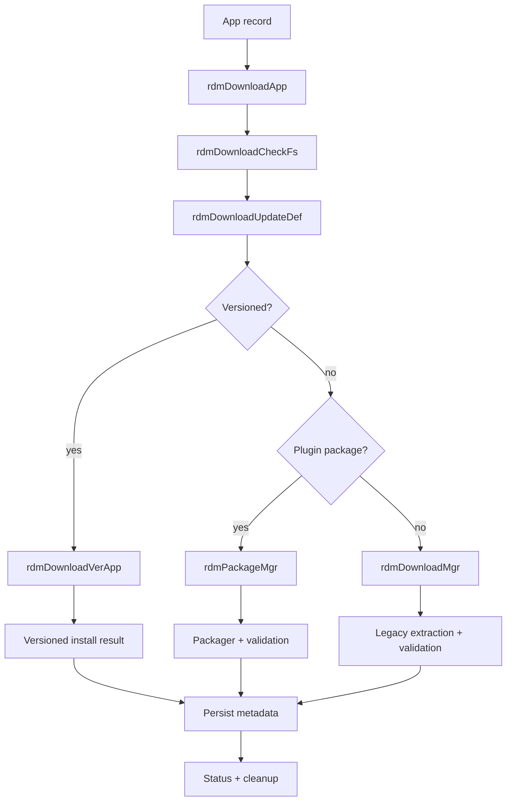
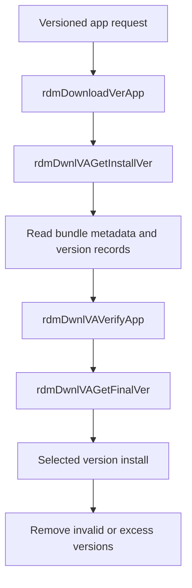
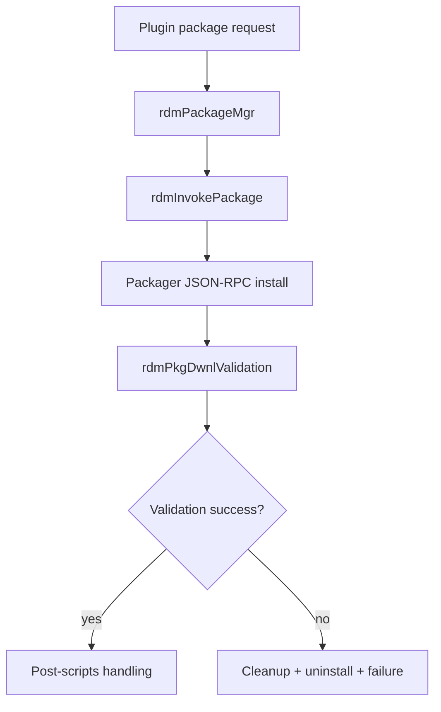
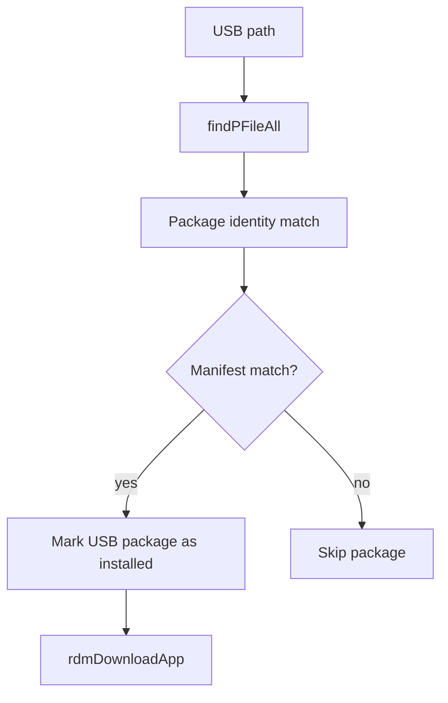
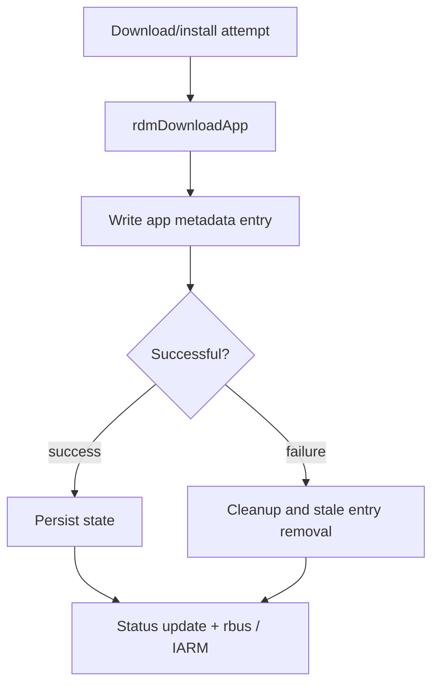

# Baseline Architecture

## Repository purpose and scope

The repository implements the rdm-agent runtime for manifest-driven package discovery, download, validation, and installation on the target device. The verified As-Is scope is a native C service that activates on a path change, reads app metadata, downloads package payloads, validates them, and installs them through one of several supported flows.

This baseline describes only what is confirmed in the production code under the repository root and the `src/`, `include/`, and top-level service files. It excludes future, proposed, or unspecified behaviors.

## Main components and responsibilities

### 1. Service entry and lifecycle
- [rdm_main.c](../../rdm_main.c)
- [rdm.h](../../rdm.h)
- [apps_rdm.path](../../apps_rdm.path)
- [apps-rdm.service](../../apps-rdm.service)

Responsibilities:
- start the service when `/tmp/.xconfssrdownloadurl` changes
- initialize the runtime handle
- initialize and teardown rbus access
- print CLI help and support a small set of install-mode entrypoints

### 2. Manifest discovery and metadata lookup
- [src/rdm_jsonquery.c](../../src/rdm_jsonquery.c)
- [rdm-manifest.json](../../rdm-manifest.json)

Responsibilities:
- parse JSON metadata
- traverse object paths
- return manifest lengths and explicit values
- resolve package metadata used by later install stages

### 3. Download orchestration and transfer
- [src/rdm_download.c](../../src/rdm_download.c)
- [src/rdm_downloadutils.c](../../src/rdm_downloadutils.c)
- [src/rdm_curldownload.c](../../src/rdm_curldownload.c)

Responsibilities:
- identify app home and download paths
- validate mount and storage readiness
- download app packages through the direct transfer flow
- update persistent app metadata after the transfer attempt

### 4. Legacy install pipeline
- [src/rdm_downloadmgr.c](../../src/rdm_downloadmgr.c)

Responsibilities:
- extract package archives
- process `packages.list`
- handle `.tar` and `.ipk` payloads
- emit extraction and failure notifications
- proceed with installation cleanup and path handling

### 5. Versioned application handling
- [src/rdm_downloadverapp.c](../../src/rdm_downloadverapp.c)

Responsibilities:
- resolve bundle metadata paths
- collect version records
- validate installed versions
- prune excess versions or uninstall invalid ones
- finalize and install the selected version set

### 6. Plugin package manager flow
- [src/rdm_packagemgr.c](../../src/rdm_packagemgr.c)

Responsibilities:
- invoke the external packager through JSON-RPC
- retry execution under retry-count logic
- validate the package state after packager run
- perform cleanup and uninstall on failure

### 7. USB installation
- [src/rdm_usbinstall.c](../../src/rdm_usbinstall.c)

Responsibilities:
- scan USB storage for candidate packages
- match the package against manifest and firmware identity
- skip mismatched packages
- trigger the normal app installation path for valid matches

### 8. Security validation
- [src/rdm_openssl.c](../../src/rdm_openssl.c)
- [src/rdm_downloadutils.c](../../src/rdm_downloadutils.c)

Responsibilities:
- prepare the signature and manifest input expected by the verification path
- verify RSA signature integrity from the package and verification material
- fail the package on signature-validation failure

### 9. rbus and status reporting
- [src/rdm_rbus.c](../../src/rdm_rbus.c)
- [src/rdm_utils.c](../../src/rdm_utils.c)

Responsibilities:
- initialize and close rbus handles
- read RFC parameters and status values
- set the download status parameter
- broadcast IARM status and package payload events

### 10. Persistent state and cleanup
- [src/rdm_download.c](../../src/rdm_download.c)
- [src/rdm_downloadutils.c](../../src/rdm_downloadutils.c)
- [rdm.h](../../rdm.h)

Responsibilities:
- maintain the metadata file used by the app download manager
- remove stale metadata or package state on failure
- manage blocked-download and retry conditions
- keep a coherent status record for the app lifecycle

## Component-to-source mapping

| Component | Source files | Key functions |
|---|---|---|
| Lifecycle and CLI entry | [rdm_main.c](../../rdm_main.c), [rdm.h](../../rdm.h) | `rdmInit`, `rdmUnInit`, `rdmHelp` |
| Manifest parsing | [src/rdm_jsonquery.c](../../src/rdm_jsonquery.c) | `cJSON_SearchFile`, `rdmJSONGetLen`, `rdmJSONQuery` |
| Download orchestration | [src/rdm_download.c](../../src/rdm_download.c) | `rdmDownloadApp`, `rdmDownloadCheckFs`, `rdmDownloadUpdateDef` |
| Download utilities | [src/rdm_downloadutils.c](../../src/rdm_downloadutils.c) | `rdmDwnlUpdateURL`, `rdmDwnlDirect`, `rdmDwnlApplication` |
| Install pipeline | [src/rdm_downloadmgr.c](../../src/rdm_downloadmgr.c) | `rdmDownloadMgr`, `rdmDwnlExtract` |
| Versioned apps | [src/rdm_downloadverapp.c](../../src/rdm_downloadverapp.c) | `rdmDownloadVerApp`, `rdmDwnlVAInstall`, `rdmDwnlVAGetFinalVer` |
| Plugin package manager | [src/rdm_packagemgr.c](../../src/rdm_packagemgr.c) | `rdmPackageMgr`, `rdmInvokePackage`, `rdmPkgDwnlValidation` |
| USB install | [src/rdm_usbinstall.c](../../src/rdm_usbinstall.c) | `rdmUSBInstall` |
| Security validation | [src/rdm_openssl.c](../../src/rdm_openssl.c) | `rdmOpensslRsafileSignatureVerify`, `prepare_sig_file` |
| rbus | [src/rdm_rbus.c](../../src/rdm_rbus.c) | `rdmRbusInit`, `rdmRbusGetRfc`, `rdmRbusSetDownloadStatus` |
| Status events | [src/rdm_utils.c](../../src/rdm_utils.c) | `rdmIARMEvntSendStatus`, `rdmIARMEvntSendPayload` |
| Persistent state | [src/rdm_download.c](../../src/rdm_download.c), [src/rdm_downloadutils.c](../../src/rdm_downloadutils.c) | `rdmDwnlUnInstallApp`, `rdmRemvDwnlAppInfo`, `rdmDwnlIsBlocked` |

## External interfaces and dependencies

The repository interacts with these external runtime components:

- systemd path/service activation via [apps_rdm.path](../../apps_rdm.path) and [apps-rdm.service](../../apps-rdm.service)
- rbus and RFC values through [src/rdm_rbus.c](../../src/rdm_rbus.c)
- IARM status broadcasting through [src/rdm_utils.c](../../src/rdm_utils.c)
- OpenSSL verification material through [src/rdm_openssl.c](../../src/rdm_openssl.c)
- JSON-RPC packager calls through [src/rdm_packagemgr.c](../../src/rdm_packagemgr.c)
- runtime filesystem and mount paths such as `/tmp`, `/opt`, `/nvram`, `/media/apps`, and `/mnt/usb`

These are treated as boundaries because the repository depends on their existence and runtime behavior without fully implementing them in-repo.

## Startup and activation flow

```mermaid
flowchart TD
    A[/tmp/.xconfssrdownloadurl changed/] --> B[apps_rdm.path]
    B --> C[apps-rdm.service]
    C --> D[/usr/bin/rdm]
    D --> E[rdm_main.c]
    E --> F[rdmInit]
    F --> G[Allocate RDMHandle]
    G --> H[rdmRbusInit]
    H --> I[Manifest and app-state flow ready]
```

The service activation is explicitly configured in the repository and is a verified runtime behavior.

## Package download and installation flow



This flow is verified from the production implementation in [src/rdm_download.c](../../src/rdm_download.c) and [src/rdm_downloadmgr.c](../../src/rdm_downloadmgr.c).

## Versioned application flow



The versioned flow is implemented in [src/rdm_downloadverapp.c](../../src/rdm_downloadverapp.c) and specifically manages versions, cleanup, and final installation selection.

## Plugin package manager flow



The plugin path is an explicit production flow in [src/rdm_packagemgr.c](../../src/rdm_packagemgr.c). The external packager is a runtime dependency, not an in-repo implementation.

## USB installation flow



The USB flow is implemented in [src/rdm_usbinstall.c](../../src/rdm_usbinstall.c).

## Security validation boundaries

The repository performs package verification using OpenSSL-based signature checking. This is verified in [src/rdm_openssl.c](../../src/rdm_openssl.c) and [src/rdm_downloadutils.c](../../src/rdm_downloadutils.c).

Validated boundary:
- the implementation verifies package authenticity using a signature verification flow
- the signature file and verification keys are runtime dependencies outside the repo

Not treated as verified repository-owned behavior beyond the in-repo verification routines:
- key management and secure storage
- vendor or platform trust-provider semantics outside the local validation functions

## Persistent state, status, retry, and cleanup handling

The repository persists app metadata in a local file and updates it while the install lifecycle runs. This is implemented in [src/rdm_download.c](../../src/rdm_download.c) and [src/rdm_downloadutils.c](../../src/rdm_downloadutils.c).

Verified behaviors include:
- app metadata is written to a persistent download-info file
- stale metadata entries are replaced atomically
- duplicate app entries are removed before writing the new state
- failed or stale app paths are cleaned up
- blocked-download and retry paths are enforced
- package status is reported through rbus and IARM



## Verified implementation boundaries

This architecture intentionally does not claim any behavior that is not directly supported by the repository, including:
- future feature proposals
- unimplemented or placeholder logic
- speculative platform deployment semantics
- test-only behavior presented as production requirements

The architecture is therefore a faithful As-Is baseline of the current implementation, not a target-state design.
