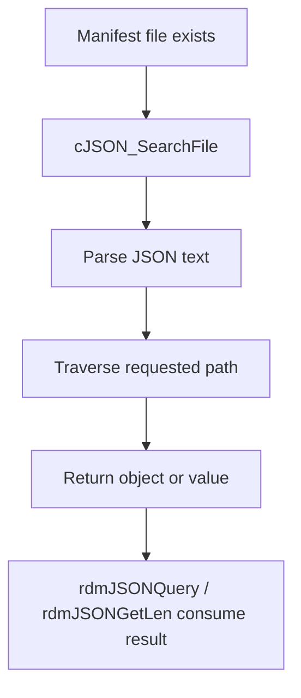

# Manifest Discovery and Metadata Resolution

## Purpose
This specification covers the JSON manifest lookup and package metadata retrieval behavior used by the RDM service to determine package information and app identities.

## Requirements

### Requirement: Manifest discovery and metadata resolution
The system SHALL read manifest content from a JSON file and traverse it by path.
The system SHALL return the number of manifest entries when requested.
The system SHALL query a manifest value by a named JSON path and return a string value.
The system SHALL fail cleanly when the manifest file name or path argument is invalid.

#### Scenario: Valid JSON file and search path
- **WHEN** a valid JSON file and a valid search path are provided
- **THEN** `cJSON_SearchFile` opens the file, loads the JSON text, traverses the requested path, and returns the matching object.

#### Scenario: Valid manifest count lookup
- **WHEN** a valid manifest file and a valid pointer for count output are provided
- **THEN** `rdmJSONGetLen` inspects the `packages` object value and sets the count to the array size when the object is an array.

#### Scenario: Valid manifest value lookup
- **WHEN** a valid manifest file, a JSON path such as a package field, and an output buffer are provided
- **THEN** `rdmJSONQuery` returns the queried value into the output buffer and uses `RDM_SUCCESS` on a valid lookup.

#### Scenario: Invalid manifest input
- **WHEN** a NULL manifest file pointer, empty file name, NULL path, or empty path is supplied
- **THEN** the JSON lookup functions log an error and return `RDM_FAILURE` instead of continuing.

## Implementation evidence
- Manifest parsing and lookup: [src/rdm_jsonquery.c](../../../src/rdm_jsonquery.c)
- Example manifest structure: [rdm-manifest.json](../../../rdm-manifest.json)
- Key functions: `cJSON_Search`, `cJSON_SearchFile`, `rdmJSONGetLen`, `rdmJSONQuery`

## External boundaries
- The manifest file location is project-defined and expected to exist in the runtime environment.
- The JSON schema is external to the repository and specific to the device platform’s app manifests.
- The code does not implement a general-purpose manifest registry beyond the file lookup and JSON path extraction used here.

## Runtime flow

