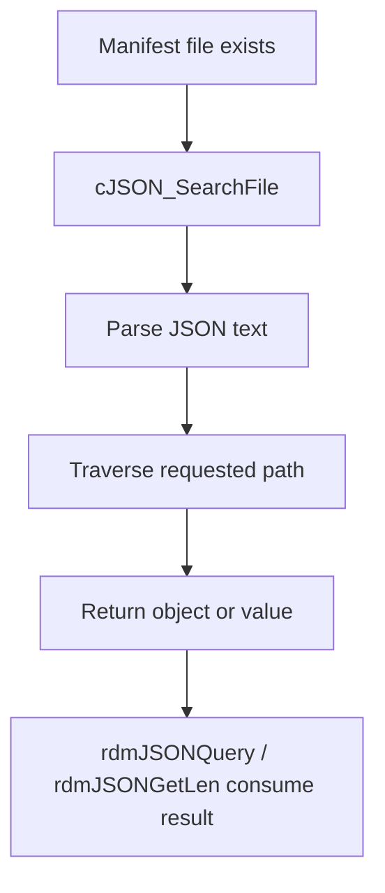

# Manifest Discovery and Metadata Resolution

## Scope
This specification covers the JSON manifest lookup and package metadata retrieval behavior used by the RDM service to determine package information and app identities.

## Implementation evidence
- Manifest parsing and lookup: [src/rdm_jsonquery.c](../../../src/rdm_jsonquery.c)
- Example manifest structure: [rdm-manifest.json](../../../rdm-manifest.json)
- Key functions: `cJSON_Search`, `cJSON_SearchFile`, `rdmJSONGetLen`, `rdmJSONQuery`

## External boundaries
- The manifest file location is project-defined and expected to exist in the runtime environment.
- The JSON schema is external to the repository and specific to the device platform’s app manifests.
- The code does not implement a general-purpose manifest registry beyond the file lookup and JSON path extraction used here.

## Requirements
1. The system must read manifest content from a JSON file and traverse it by path.
2. The system must return the number of manifest entries when requested.
3. The system must query a manifest value by a named JSON path and return a string value.
4. The system must fail cleanly when the manifest file name or path argument is invalid.

## GIVEN / WHEN / THEN scenarios
### Requirement 1
GIVEN a valid JSON file and a valid search path
WHEN `cJSON_SearchFile` executes
THEN it opens the file, loads the JSON text, traverses the requested path, and returns the matching object.

### Requirement 2
GIVEN a valid manifest file and a valid pointer for count output
WHEN `rdmJSONGetLen` executes
THEN it inspects the `packages` object value and sets the count to the array size when the object is an array.

### Requirement 3
GIVEN a valid manifest file, a JSON path such as a package field, and an output buffer
WHEN `rdmJSONQuery` runs
THEN it returns the queried value into the output buffer and uses `RDM_SUCCESS` on a valid lookup.

### Requirement 4
GIVEN a NULL manifest file pointer, empty file name, NULL path, or empty path
WHEN the JSON lookup functions run
THEN they log an error and return `RDM_FAILURE` instead of continuing.

## Runtime flow

