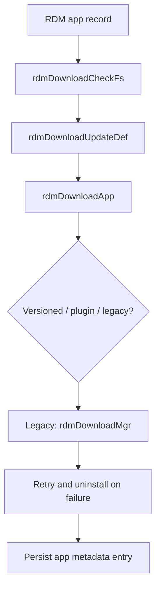

# Package Download and Transfer

## Purpose
This specification covers the direct package download and file-transfer flow used to obtain app artifacts and associated metadata for installation.

## Requirements

### Requirement: Package download and transfer flow
The service SHALL determine app home and download paths before the transfer step.
The service SHALL validate the target storage path before download and reset the app record to the default paths when the configured target is not viable.
The service SHALL update the package metadata file with the final app state after the transfer attempt.
The service SHALL retry the legacy package installation flow when a package download/install step fails.

#### Scenario: App record path preparation
- **WHEN** an app record with name, package name, and mount target is processed
- **THEN** `rdmDownloadUpdateDef` populates the app mount path, app home, download path, and metadata file path using the default application path definitions.

#### Scenario: Non-working filesystem target
- **WHEN** a package record has a download target in a non-working filesystem
- **THEN** `rdmDownloadCheckFs` logs the condition and returns `RDM_FAILURE` rather than proceeding with the download path.

#### Scenario: Successful download path execution
- **WHEN** a valid app record and successful path validation are present
- **THEN** `rdmDownloadApp` invokes `rdmDownloadMgr`, updates the download status, and writes the package metadata entry to the persistent download-info file.

#### Scenario: Retry after legacy install failure
- **WHEN** repeated failure occurs in the legacy install sequence while the retry count limit is not reached
- **THEN** the loop invokes `rdmDwnlUnInstallApp` and retries the download/install sequence.

## Implementation evidence
- Download orchestration and filesystem checks: [src/rdm_download.c](../../../src/rdm_download.c)
- Download utilities and transfer logic: [src/rdm_downloadutils.c](../../../src/rdm_downloadutils.c), [src/rdm_curldownload.c](../../../src/rdm_curldownload.c)
- Key functions: `rdmDownloadApp`, `rdmDownloadCheckFs`, `rdmDownloadUpdateDef`, `rdmDwnlUpdateURL`, `rdmDwnlDirect`, `rdmDwnlApplication`, `doHttpFileDownload`

## External boundaries
- Download targets and URLs are runtime-configured and may point to device- or platform-specific endpoints.
- Network transport, TLS certificate validation, and remote resource availability are external dependencies of the transfer layer.
- Storage-path selection and mounted filesystem layout depend on the host device environment.

## Runtime flow

