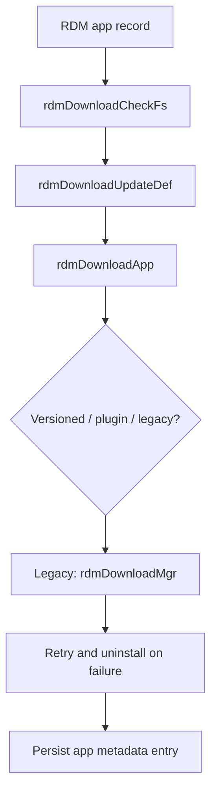

# Package Download and Transfer

## Scope
This specification covers the direct package download and file-transfer flow used to obtain app artifacts and associated metadata for installation.

## Implementation evidence
- Download orchestration and filesystem checks: [src/rdm_download.c](../../../src/rdm_download.c)
- Download utilities and transfer logic: [src/rdm_downloadutils.c](../../../src/rdm_downloadutils.c), [src/rdm_curldownload.c](../../../src/rdm_curldownload.c)
- Key functions: `rdmDownloadApp`, `rdmDownloadCheckFs`, `rdmDownloadUpdateDef`, `rdmDwnlUpdateURL`, `rdmDwnlDirect`, `rdmDwnlApplication`, `doHttpFileDownload`

## External boundaries
- Download targets and URLs are runtime-configured and may point to device- or platform-specific endpoints.
- Network transport, TLS certificate validation, and remote resource availability are external dependencies of the transfer layer.
- Storage-path selection and mounted filesystem layout depend on the host device environment.

## Requirements
1. The service must determine app home and download paths before the transfer step.
2. The service must validate the target storage path before download and fail if it is not viable.
3. The service must update the package metadata file with the final app state after the transfer attempt.
4. The service must retry the legacy package installation flow when a package download/install step fails.

## GIVEN / WHEN / THEN scenarios
### Requirement 1
GIVEN an app record with name, package name, and mount target
WHEN `rdmDownloadUpdateDef` runs
THEN it populates the app mount path, app home, download path, and metadata file path using the default application path definitions.

### Requirement 2
GIVEN a package record with a download target in a non-working filesystem
WHEN `rdmDownloadCheckFs` executes
THEN it logs the condition and returns `RDM_FAILURE` rather than proceeding with the download path.

### Requirement 3
GIVEN a valid app record and successful path validation
WHEN `rdmDownloadApp` executes the legacy path
THEN it invokes `rdmDownloadMgr`, updates the download status, and writes the package metadata entry to the persistent download-info file.

### Requirement 4
GIVEN repeated failure in the legacy install sequence while the retry count limit is not reached
WHEN the loop continues
THEN it invokes `rdmDwnlUnInstallApp`, then retries the download/install sequence.

## Runtime flow

