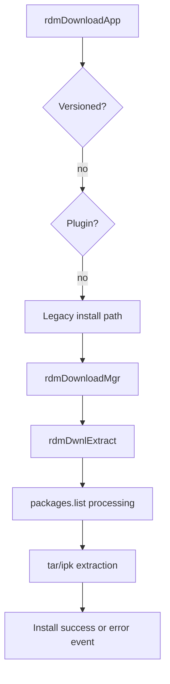

# Package Installation Pipeline

## Scope
This specification covers the legacy package installation flow, extraction pipeline, package-list handling, and install-state event reporting used by the RDM service.

## Implementation evidence
- Main install workflow: [src/rdm_downloadmgr.c](../../../src/rdm_downloadmgr.c)
- Download orchestration entrypoint: [src/rdm_download.c](../../../src/rdm_download.c)
- Key functions: `rdmDownloadMgr`, `rdmDwnlExtract`, `rdmDwnlRetryIfRequiredFileMissing`, `rdmDownlLXCCheck`, `rdmIARMEvntSendPayload`

## External boundaries
- Archive extraction and package file processing require the target filesystem and installed package tools in the runtime environment.
- The actual package payload semantics and application installation actions are dependent on the package content and host OS integration.
- IARM notifications are emitted to the external system bus and are not defined within this repository as an external contract schema.

## Requirements
1. The system must extract the downloaded package into the configured download path before install processing.
2. The system must handle both `.tar` and `.ipk` package entries in the extracted package list.
3. The system must treat a missing `packages.list` as a failure condition for legacy package extraction.
4. The system must emit an install error event when extraction fails.
5. The system must support a non-versioned app install path without delegating to the versioned app logic.

## GIVEN / WHEN / THEN scenarios
### Requirement 1
GIVEN a valid downloaded package file in the app download path
WHEN `rdmDwnlExtract` executes
THEN it invokes `tarExtract` or subsequent archive handling based on the package type and extracts content into the app path.

### Requirement 2
GIVEN a `packages.list` entry with a `.tar` extension
WHEN the extraction loop reads the file
THEN it extracts the archive into the application home directory.

GIVEN a `packages.list` entry with an `.ipk` extension
WHEN the package is processed
THEN it extracts the archive content and handles the LXC check path before continuing.

### Requirement 3
GIVEN the package list file is missing from the extracted download directory
WHEN `rdmDwnlExtract` reaches the `packages.list` read step
THEN it logs the missing file, emits the telemetry count, and returns `RDM_FAILURE`.

### Requirement 4
GIVEN an extraction failure for a tar or ipk payload
WHEN the failure occurs
THEN the function emits `rdmIARMEvntSendPayload` with the package error code and logs the failure.

### Requirement 5
GIVEN a package record that is not marked as versioned and is not plugin-based
WHEN `rdmDownloadApp` reaches the legacy flow
THEN it calls `rdmDownloadMgr` and continues with the standard legacy package installation pipeline.

## Runtime flow

