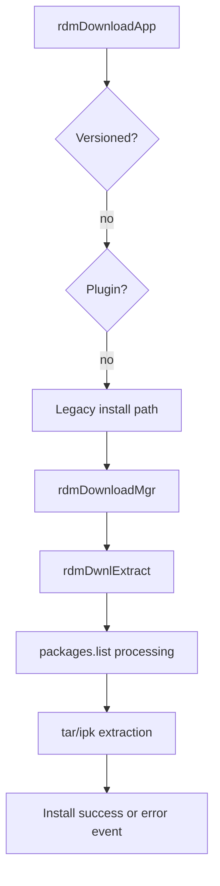

# Package Installation Pipeline

## Purpose
This specification covers the legacy package installation flow, extraction pipeline, package-list handling, and install-state event reporting used by the RDM service.

## Requirements

### Requirement: Legacy package extraction and installation
The system SHALL extract the downloaded package into the configured download path before install processing.
The system SHALL handle both `.tar` and `.ipk` package entries in the extracted package list.
The system SHALL treat a missing `packages.list` as a failure condition for legacy package extraction.
The system SHALL emit an install error event when extraction of a `.tar` or `.ipk` entry from `packages.list` fails in the package-processing loop.
The system SHALL support a non-versioned app install path without delegating to the versioned app logic.

#### Scenario: Valid downloaded package extraction
- **WHEN** a valid downloaded package file is present in the app download path
- **THEN** `rdmDwnlExtract` invokes `tarExtract` or subsequent archive handling based on the package type and extracts content into the app path.

#### Scenario: `.tar` and `.ipk` package entries
- **WHEN** a `packages.list` entry contains a `.tar` extension
- **THEN** the extraction loop extracts the archive into the application home directory.
- **WHEN** a `packages.list` entry contains an `.ipk` extension
- **THEN** the package is processed, its archive content is extracted, and the LXC check path is handled before continuing.

#### Scenario: Missing package list
- **WHEN** the package list file is missing from the extracted download directory
- **THEN** `rdmDwnlExtract` logs the missing file, emits the telemetry count, and returns `RDM_FAILURE`.

#### Scenario: Package-list entry extraction failure
- **WHEN** extraction fails while processing a `.tar` or `.ipk` entry from `packages.list`
- **THEN** the function emits `rdmIARMEvntSendPayload` with the package error code and logs the failure.

#### Scenario: Standard legacy flow
- **WHEN** a package record is not marked as versioned and is not plugin-based
- **THEN** `rdmDownloadApp` calls `rdmDownloadMgr` and continues with the standard legacy package installation pipeline.

## Implementation evidence
- Main install workflow: [src/rdm_downloadmgr.c](../../../src/rdm_downloadmgr.c)
- Download orchestration entrypoint: [src/rdm_download.c](../../../src/rdm_download.c)
- Key functions: `rdmDownloadMgr`, `rdmDwnlExtract`, `rdmDwnlRetryIfRequiredFileMissing`, `rdmDownlLXCCheck`, `rdmIARMEvntSendPayload`

## External boundaries
- Archive extraction and package file processing require the target filesystem and installed package tools in the runtime environment.
- The actual package payload semantics and application installation actions are dependent on the package content and host OS integration.
- IARM notifications are emitted to the external system bus and are not defined within this repository as an external contract schema.

## Runtime flow

