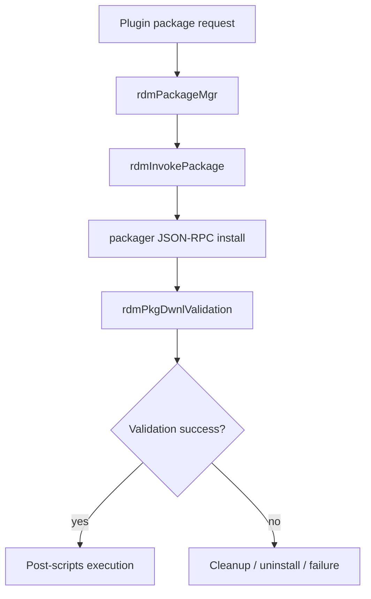

# Plugin Package Installation

## Purpose
This specification covers the verified package-manager installation flow that invokes the external packager and validates the result before treating the package as installed.

## Requirements

### Requirement: Plugin package installation
The service SHALL invoke the packager process when the package type is `plugin`.
The service SHALL retry packager execution until a retry limit is reached or the package operation succeeds.
The service SHALL validate the package after packager execution and fail when the validation signals indicate package download, extraction, or signature failure.
The service SHALL uninstall the package state on validation failure and then return an error.

#### Scenario: Plugin package request
- **WHEN** a package record with `pkg_type` equal to `plugin` is processed
- **THEN** `rdmDownloadApp` calls `rdmPackageMgr` instead of the legacy install flow.

#### Scenario: Packager invocation
- **WHEN** the packager is available and receives a package install request
- **THEN** `rdmInvokePackage` sends the JSON-RPC install call to the configured package endpoint and waits for success or a retry condition.

#### Scenario: Validation failure cleanup
- **WHEN** the packager request returns failure or the validation sentinel files indicate package failure
- **THEN** `rdmPkgDwnlValidation` returns `RDM_FAILURE` and cleans up the package state for the failed install.

#### Scenario: Failure path uninstall
- **WHEN** a validation failure occurs after install invocation
- **THEN** `rdmDwnlUnInstallApp` is called and the function exits with an error state.

## Implementation evidence
- Plugin install logic: [src/rdm_packagemgr.c](../../../src/rdm_packagemgr.c)
- Key functions: `rdmPackageMgr`, `rdmInvokePackage`, `rdmPkgDwnlApplication`, `rdmPkgDwnlValidation`, `rdmDwnlRunPostScripts`

## External boundaries
- The actual package installation is delegated to the packager service and its JSON-RPC endpoint, which is an external runtime dependency.
- Authorization token acquisition and packager execution depend on the host system and WPE security utility.
- This repository implements the orchestration and validation logic, not the external packager implementation itself.

## Runtime flow

