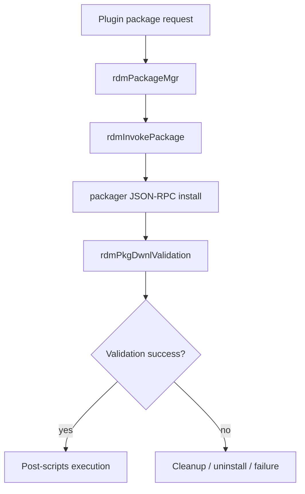

# Plugin Package Installation

## Scope
This specification covers the verified package-manager installation flow that invokes the external packager and validates the result before treating the package as installed.

## Implementation evidence
- Plugin install logic: [src/rdm_packagemgr.c](../../../src/rdm_packagemgr.c)
- Key functions: `rdmPackageMgr`, `rdmInvokePackage`, `rdmPkgDwnlApplication`, `rdmPkgDwnlValidation`, `rdmDwnlRunPostScripts`

## External boundaries
- The actual package installation is delegated to the packager service and its JSON-RPC endpoint, which is an external runtime dependency.
- Authorization token acquisition and packager execution depend on the host system and WPE security utility.
- This repository implements the orchestration and validation logic, not the external packager implementation itself.

## Requirements
1. The service must invoke the packager process when the package type is `plugin`.
2. The service must retry packager execution until a retry limit is reached or the package operation succeeds.
3. The service must validate the package after packager execution and fail when the validation signals indicate package download, extraction, or signature failure.
4. The service must uninstall the package state on validation failure and then return an error.

## GIVEN / WHEN / THEN scenarios
### Requirement 1
GIVEN a package record with `pkg_type` equal to `plugin`
WHEN `rdmDownloadApp` reaches the plugin path
THEN it calls `rdmPackageMgr` instead of the legacy install flow.

### Requirement 2
GIVEN the packager is available and receives a package install request
WHEN `rdmInvokePackage` executes
THEN it sends the JSON-RPC install call to the configured package endpoint and waits for success or a retry condition.

### Requirement 3
GIVEN the packager request returns failure or the validation sentinel files indicate package failure
WHEN `rdmPkgDwnlValidation` runs
THEN it returns `RDM_FAILURE` and cleans up the package state for the failed install.

### Requirement 4
GIVEN a validation failure occurs after install invocation
WHEN the failure path executes
THEN `rdmDwnlUnInstallApp` is called and the function exits with an error state.

## Runtime flow

