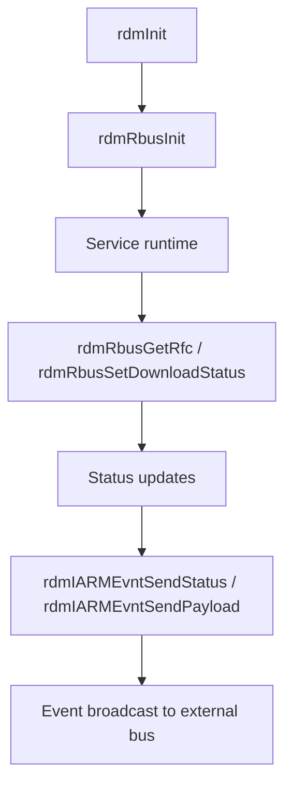

# rbus Integration and Status Reporting

## Scope
This specification covers the verified rbus/RFC read/write behavior and the IARM status notifications emitted by the RDM service during app download and installation.

## Implementation evidence
- rbus operations: [src/rdm_rbus.c](../../../src/rdm_rbus.c)
- Status notification routines: [src/rdm_utils.c](../../../src/rdm_utils.c)
- Key functions: `rdmRbusInit`, `rdmRbusGetRfc`, `rdmRbusUnInit`, `rdmRbusSetDownloadStatus`, `rdmIARMEvntSendStatus`, `rdmIARMEvntSendPayload`

## External boundaries
- rbus is an external runtime service and the repository depends on its local availability and parameter contract.
- IARM bus message payloads and event names are defined by the host integration layer and are not fully specified within this repository.
- The repository implements the call pattern and usage, not the external bus implementation itself.

## Requirements
1. The service must initialize and close the rbus handle during lifecycle startup and teardown.
2. The service must read RFC values through rbus and handle both Boolean and string result types.
3. The service must set the download-status parameter when the package workflow updates status.
4. The service must broadcast status and package payload events over IARM when install processing reaches a status point.

## GIVEN / WHEN / THEN scenarios
### Requirement 1
GIVEN a valid handle and rbus name
WHEN `rdmRbusInit` runs
THEN it checks that rbus is active, opens the bus with the supplied name, and stores the handle for later access.

### Requirement 2
GIVEN a valid RFC name and a non-NULL value pointer
WHEN `rdmRbusGetRfc` executes
THEN it requests the value from rbus, interprets a Boolean or string response, and updates the output value accordingly.

### Requirement 3
GIVEN a valid rbus handle and a download-state Boolean
WHEN `rdmRbusSetDownloadStatus` executes
THEN it writes the status to `Device.DeviceInfo.X_RDKCENTRAL-COM_RDKDownloadManager.DownloadStatus` and returns `RDM_SUCCESS` on success.

### Requirement 4
GIVEN a package install or extraction failure or state update that requires notification
WHEN `rdmIARMEvntSendPayload` or `rdmIARMEvntSendStatus` runs
THEN it emits the corresponding IARM event using the package name, version, path, and status fields.

## Runtime flow

