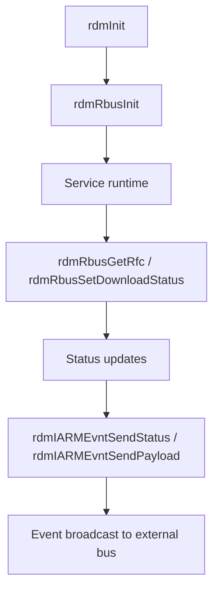

# rbus Integration and Status Reporting

## Purpose
This specification covers the verified rbus/RFC read/write behavior and the IARM status notifications emitted by the RDM service during app download and installation.

## Requirements

### Requirement: rbus initialization and status reporting
The service SHALL initialize and close the rbus handle during lifecycle startup and teardown.
The service SHALL read RFC values through rbus and handle both Boolean and string result types.
The service SHALL set the download-status parameter when the package workflow updates status.
The service SHALL broadcast status and package payload events over IARM when install processing reaches a status point.

#### Scenario: rbus initialization
- **WHEN** a valid handle and rbus name are provided
- **THEN** `rdmRbusInit` checks that rbus is active, opens the bus with the supplied name, and stores the handle for later access.

#### Scenario: RFC value retrieval
- **WHEN** a valid RFC name and a non-NULL value pointer are provided
- **THEN** `rdmRbusGetRfc` requests the value from rbus, interprets a Boolean or string response, and updates the output value accordingly.

#### Scenario: Download status update
- **WHEN** a valid rbus handle and a download-state Boolean are supplied
- **THEN** `rdmRbusSetDownloadStatus` writes the status to `Device.DeviceInfo.X_RDKCENTRAL-COM_RDKDownloadManager.DownloadStatus` and returns `RDM_SUCCESS` on success.

#### Scenario: Status event broadcasting
- **WHEN** a package install or extraction failure or state update requires notification
- **THEN** `rdmIARMEvntSendPayload` or `rdmIARMEvntSendStatus` emits the corresponding IARM event using the package name, version, path, and status fields.

## Implementation evidence
- rbus operations: [src/rdm_rbus.c](../../../src/rdm_rbus.c)
- Status notification routines: [src/rdm_utils.c](../../../src/rdm_utils.c)
- Key functions: `rdmRbusInit`, `rdmRbusGetRfc`, `rdmRbusUnInit`, `rdmRbusSetDownloadStatus`, `rdmIARMEvntSendStatus`, `rdmIARMEvntSendPayload`

## External boundaries
- rbus is an external runtime service and the repository depends on its local availability and parameter contract.
- IARM bus message payloads and event names are defined by the host integration layer and are not fully specified within this repository.
- The repository implements the call pattern and usage, not the external bus implementation itself.

## Runtime flow

