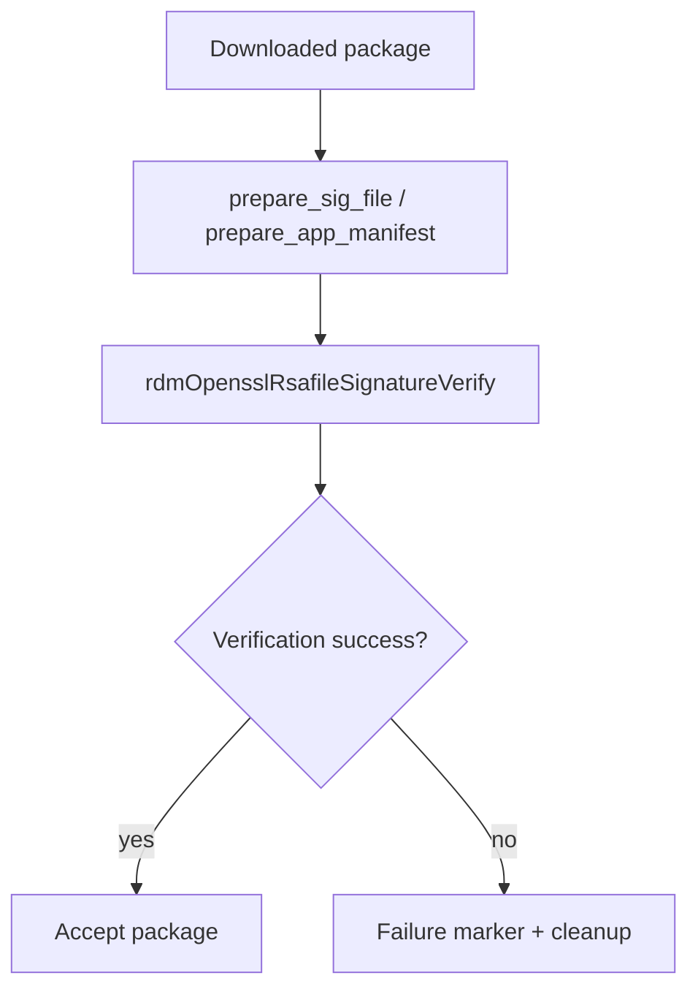

# Security Validation and Integrity Checks

## Purpose
This specification covers the verified signature verification and package integrity checks performed before or during package acceptance.

## Requirements

### Requirement: Security validation and integrity checks
The service SHALL prepare the signature file and app manifest before validation when the verification flow requires them.
The service SHALL verify the app package using the RSA signature flow implemented in the OpenSSL module.
The service SHALL treat explicit download, extraction, or signature-verification failure sentinel states as package failure conditions.
The service SHALL clean up package state on failed validation and return an error.

#### Scenario: OpenSSL preparation before verification
- **WHEN** a package signature file and a prepared manifest need verification
- **THEN** the OpenSSL preparation functions rewrite the signature file and generate the manifest input needed for the validation step.

#### Scenario: RSA signature verification
- **WHEN** a data file, signature file, and verification key are available
- **THEN** `rdmOpensslRsafileSignatureVerify` verifies the package against the configured key and returns the verification result.

#### Scenario: Validation sentinel failure
- **WHEN** package validation sentinel files indicate download, extraction, or verification failure
- **THEN** `rdmPkgDwnlValidation` logs the failure reason, removes the failure marker, and returns `RDM_FAILURE`.

#### Scenario: Plugin flow validation failure
- **WHEN** a package validation failure occurs in the plugin flow
- **THEN** the error path removes the package from the install path and returns failure so the install is not treated as successful.

## Implementation evidence
- OpenSSL validation and manifest preparation: [src/rdm_openssl.c](../../../src/rdm_openssl.c)
- Validation and package check helpers: [src/rdm_downloadutils.c](../../../src/rdm_downloadutils.c)
- Key functions: `rdmDwnlValidation`, `rdmOpensslRsafileSignatureVerify`, `prepare_sig_file`, `prepare_app_manifest`, `rdmPkgDwnlValidation`

## External boundaries
- Signature verification relies on OpenSSL and external certificate/key material in the runtime environment.
- The repository implements the verification routines, but key files and signing data are external runtime inputs.
- This is not a general-purpose secure-boot or certificate-management system; it is focused on package integrity checks for downloaded app artifacts.

## Runtime flow

