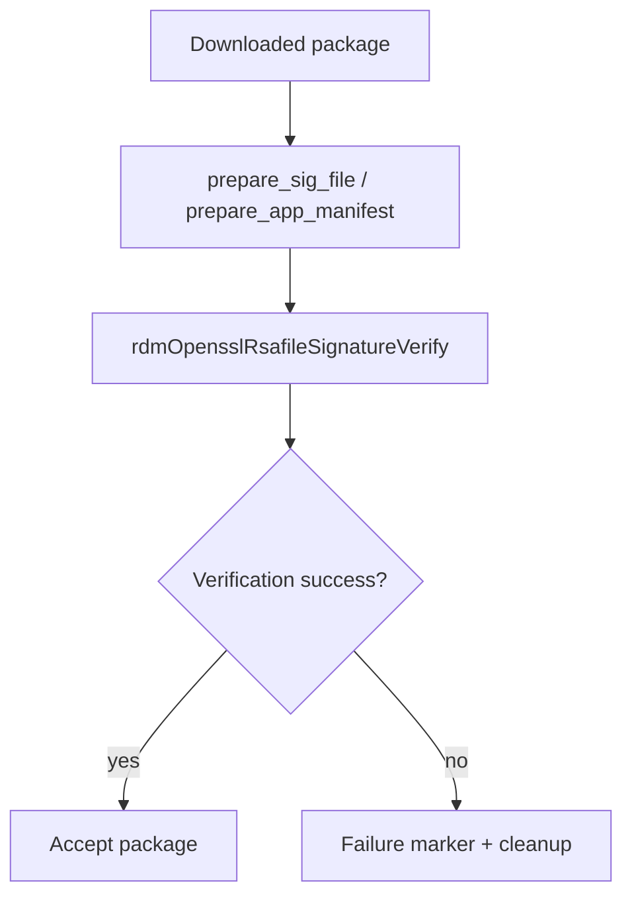

# Security Validation and Integrity Checks

## Scope
This specification covers the verified signature verification and package integrity checks performed before or during package acceptance.

## Implementation evidence
- OpenSSL validation and manifest preparation: [src/rdm_openssl.c](../../../src/rdm_openssl.c)
- Validation and package check helpers: [src/rdm_downloadutils.c](../../../src/rdm_downloadutils.c)
- Key functions: `rdmDwnlValidation`, `rdmOpensslRsafileSignatureVerify`, `prepare_sig_file`, `prepare_app_manifest`, `rdmPkgDwnlValidation`

## External boundaries
- Signature verification relies on OpenSSL and external certificate/key material in the runtime environment.
- The repository implements the verification routines, but key files and signing data are external runtime inputs.
- This is not a general-purpose secure-boot or certificate-management system; it is focused on package integrity checks for downloaded app artifacts.

## Requirements
1. The service must prepare the signature file and app manifest before validation when the verification flow requires them.
2. The service must verify the app package using the RSA signature flow implemented in the OpenSSL module.
3. The service must treat missing or failed validation sentinel states as package failure conditions.
4. The service must clean up package state on failed validation and return an error.

## GIVEN / WHEN / THEN scenarios
### Requirement 1
GIVEN a package signature file and a prepared manifest need verification
WHEN the OpenSSL preparation functions run
THEN they rewrite the signature file and generate the manifest input needed for the validation step.

### Requirement 2
GIVEN a data file, signature file, and verification key
WHEN `rdmOpensslRsafileSignatureVerify` executes
THEN it verifies the package against the configured key and returns the verification result.

### Requirement 3
GIVEN package validation sentinel files indicate download, extraction, or verification failure
WHEN `rdmPkgDwnlValidation` executes its polling loop
THEN it logs the failure reason, removes the failure marker, and returns `RDM_FAILURE`.

### Requirement 4
GIVEN a package validation failure occurs in the plugin flow
WHEN the error path is reached
THEN it removes the package from the install path and returns failure so the install is not treated as successful.

## Runtime flow

