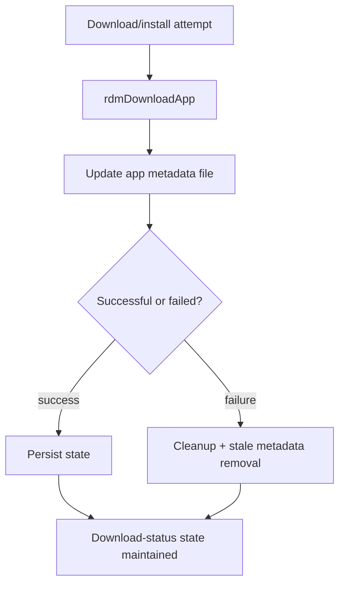

# Persistent State, Cleanup, and Retry Handling

## Scope
This specification covers the verified persistent metadata updates, cleanup behavior, and retry/block logic used by the download and install state machine.

## Implementation evidence
- App state and metadata persistence: [rdm.h](../../../rdm.h), [src/rdm_download.c](../../../src/rdm_download.c)
- Cleanup and retry logic: [src/rdm_downloadutils.c](../../../src/rdm_downloadutils.c)
- Key functions: `rdmDownloadApp`, `rdmDwnlUnInstallApp`, `rdmDwnlCleanUp`, `rdmDwnlIsBlocked`, `rdmRemvDwnlAppInfo`, `rdmDownloadCheckFs`

## External boundaries
- File paths and mount locations are runtime environment values defined by the target device.
- The persistent metadata files are stored in local device paths under `/opt` and `/nvram`, not in the repository itself.
- Cleanup decisions depend on local filesystem health and available storage, which are platform-specific runtime conditions.

## Requirements
1. The service must maintain a download metadata file that persists the app name, package name, app home, size, and status.
2. The service must create the metadata parent directory if it is missing.
3. The service must replace prior metadata entries for the same app with a current state record.
4. The service must clean up stale or failed package state and remove stale metadata entries when necessary.
5. The service must avoid re-download loops by checking whether the package is already available or blocked by the configured conditions.

## GIVEN / WHEN / THEN scenarios
### Requirement 1
GIVEN a valid app state record in `rdmDownloadApp`
WHEN the workflow completes the package attempt
THEN it writes the package metadata line in the configured `rdmDownloadInfo.txt` file using app name, package name, app home, size, and status.

### Requirement 2
GIVEN the metadata directory does not exist
WHEN the process creates the app metadata record
THEN it calls `createDir` on the parent directory before writing the file.

### Requirement 3
GIVEN the metadata file already contains a previous entry for the same app
WHEN the update logic runs
THEN it removes the duplicate entry and appends the latest state before renaming the temp file into place.

### Requirement 4
GIVEN a failed install or stale app state is present
WHEN `rdmDwnlUnInstallApp`, `rdmDwnlCleanUp`, or `rdmRemvDwnlAppInfo` runs
THEN it removes the stale app path or stale metadata record as part of cleanup.

### Requirement 5
GIVEN the app is already downloaded in the secondary storage or the package is in a blocked window
WHEN `rdmDownloadCheckFs` or `rdmDwnlIsBlocked` executes
THEN it either skips the re-download or aborts the transfer based on the local filesystem and block conditions.

## Runtime flow

