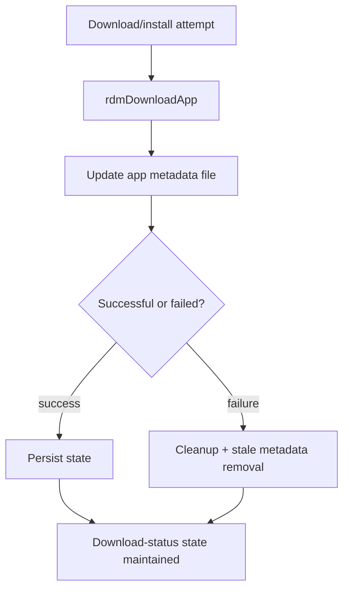

# Persistent State, Cleanup, and Retry Handling

## Purpose
This specification covers the verified persistent metadata updates, cleanup behavior, and retry/block logic used by the download and install state machine.

## Requirements

### Requirement: Persistent state and cleanup handling
The service SHALL maintain a download metadata file that persists the app name, package name, app home, size, and status.
The service SHALL create the metadata parent directory if it is missing.
The service SHALL remove prior metadata entries whose line prefix matches the current app name before appending the current state record.
The service SHALL clean up stale or failed package state and remove stale metadata entries when necessary.
The service SHALL avoid re-download loops by checking whether the package is already available or blocked by the configured conditions.

#### Scenario: Metadata persistence for app state
- **WHEN** a valid app state record is present in `rdmDownloadApp` and the workflow completes the package attempt
- **THEN** it writes the package metadata line in the configured `rdmDownloadInfo.txt` file using app name, package name, app home, size, and status.

#### Scenario: Missing metadata directory
- **WHEN** the metadata directory does not exist
- **THEN** the process calls `createDir` on the parent directory before writing the file.

#### Scenario: Duplicate metadata replacement for the same app identifier
- **WHEN** the metadata file already contains a previous app entry whose app-name token matches the current app identifier exactly
- **THEN** the update logic removes that specific duplicate entry and appends the latest state before renaming the temp file into place.

#### Scenario: Cleanup on failure or stale state
- **WHEN** a failed install or stale app state is present
- **THEN** `rdmDwnlUnInstallApp`, `rdmDwnlCleanUp`, or `rdmRemvDwnlAppInfo` removes the stale app path or stale metadata record as part of cleanup.

#### Scenario: Re-download and block avoidance
- **WHEN** the app is already downloaded in the secondary storage or the package is in a blocked window
- **THEN** `rdmDownloadCheckFs` or `rdmDwnlIsBlocked` either skips the re-download or aborts the transfer based on the local filesystem and block conditions.

## Implementation evidence
- App state and metadata persistence: [rdm.h](../../../rdm.h), [src/rdm_download.c](../../../src/rdm_download.c)
- Cleanup and retry logic: [src/rdm_downloadutils.c](../../../src/rdm_downloadutils.c)
- Key functions: `rdmDownloadApp`, `rdmDwnlUnInstallApp`, `rdmDwnlCleanUp`, `rdmDwnlIsBlocked`, `rdmRemvDwnlAppInfo`, `rdmDownloadCheckFs`

## External boundaries
- File paths and mount locations are runtime environment values defined by the target device.
- The persistent metadata files are stored in local device paths under `/opt` and `/nvram`, not in the repository itself.
- Cleanup decisions depend on local filesystem health and available storage, which are platform-specific runtime conditions.

## Runtime flow

