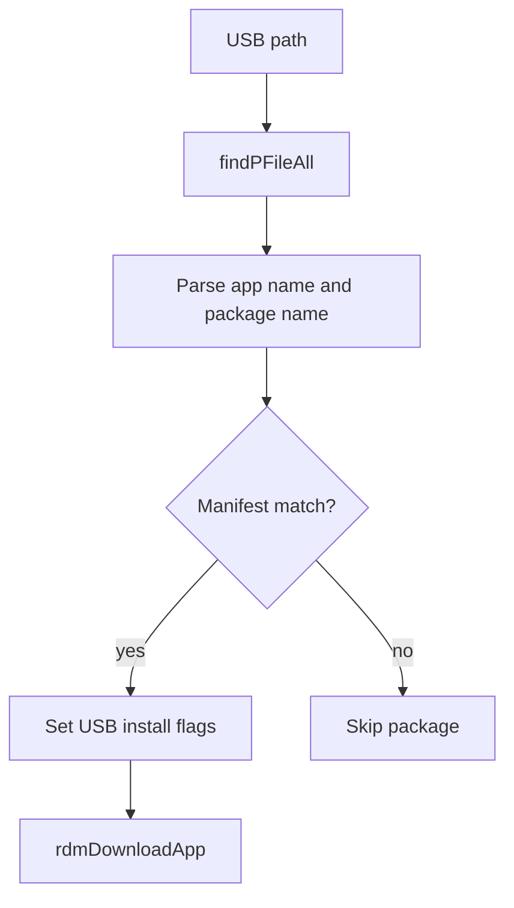

# USB Installation

## Purpose
This specification covers the verified USB package install flow that scans USB content, matches the package against the current firmware manifest, and then invokes the normal download/install pipeline for the matching package.

## Requirements

### Requirement: USB installation flow
The service SHALL scan the USB path for candidate package archives.
The service SHALL resolve package details from the manifest by app name before applying the USB install.
The service SHALL skip candidates that do not match the current firmware package identity.
The service SHALL mark USB-provided packages as already downloaded and continue through the standard installation pipeline.

#### Scenario: USB candidate discovery
- **WHEN** a USB path is supplied to `rdmUSBInstall`
- **THEN** it scans the path for archive candidates and identifies package entries using the configured USB search logic and iterates the candidate list.

#### Scenario: Manifest match for scanned package
- **WHEN** a scanned package matches a package name in the manifest
- **THEN** `rdmJSONGetAppDetName` populates `RDMAPPDetails` with the package identity and app metadata needed for the standard install path.

#### Scenario: Firmware mismatch skip
- **WHEN** a package name does not match the currently running firmware package identity
- **THEN** the package comparison logs the mismatch and skips the package rather than installing it.

#### Scenario: Valid USB package install trigger
- **WHEN** a valid USB package match is found
- **THEN** the method sets `dwld_status = 1`, sets `is_usb = 1`, and calls `rdmDownloadApp` for the standard package workflow.

## Implementation evidence
- USB install flow: [src/rdm_usbinstall.c](../../../src/rdm_usbinstall.c)
- Related app metadata lookup: [src/rdm_jsonquery.c](../../../src/rdm_jsonquery.c)
- Key functions: `rdmUSBInstall`, `findPFileAll`, `rdmJSONGetAppDetName`, `rdmUpdateAppDetails`, `rdmDownloadApp`

## External boundaries
- The actual USB storage contents and device mount path are runtime environment inputs.
- The matching logic compares package data against the manifest and current firmware identity, which is platform-specific.
- The package installation itself still follows the main download workflow after the USB candidate is matched.

## Runtime flow

