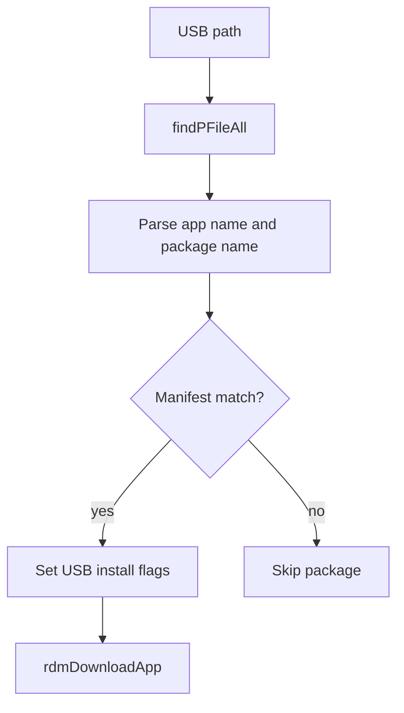

# USB Installation

## Scope
This specification covers the verified USB package install flow that scans USB content, matches the package against the current firmware manifest, and then invokes the normal download/install pipeline for the matching package.

## Implementation evidence
- USB install flow: [src/rdm_usbinstall.c](../../../src/rdm_usbinstall.c)
- Related app metadata lookup: [src/rdm_jsonquery.c](../../../src/rdm_jsonquery.c)
- Key functions: `rdmUSBInstall`, `findPFileAll`, `rdmJSONGetAppDetName`, `rdmUpdateAppDetails`, `rdmDownloadApp`

## External boundaries
- The actual USB storage contents and device mount path are runtime environment inputs.
- The matching logic compares package data against the manifest and current firmware identity, which is platform-specific.
- The package installation itself still follows the main download workflow after the USB candidate is matched.

## Requirements
1. The service must scan the USB path for candidate package archives.
2. The service must resolve package details from the manifest by app name before applying the USB install.
3. The service must skip candidates that do not match the current firmware package identity.
4. The service must mark USB-provided packages as already downloaded and continue through the standard installation pipeline.

## GIVEN / WHEN / THEN scenarios
### Requirement 1
GIVEN a USB path is supplied to `rdmUSBInstall`
WHEN it scans the path for archive candidates
THEN it identifies package entries using the configured USB search logic and iterates the candidate list.

### Requirement 2
GIVEN a scanned package matches a package name in the manifest
WHEN `rdmJSONGetAppDetName` executes
THEN it populates `RDMAPPDetails` with the package identity and app metadata needed for the standard install path.

### Requirement 3
GIVEN a package name does not match the currently running firmware package identity
WHEN the package comparison executes
THEN it logs the mismatch and skips the package rather than installing it.

### Requirement 4
GIVEN a valid USB package match is found
WHEN the method prepares the app details
THEN it sets `dwld_status = 1`, sets `is_usb = 1`, and calls `rdmDownloadApp` for the standard package workflow.

## Runtime flow

