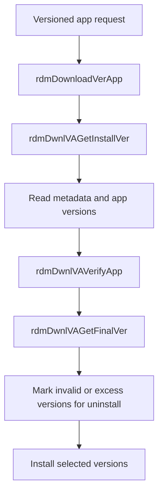

# Versioned App Management

## Purpose
This specification covers the verified versioned app lifecycle logic that selects installed versions, validates candidate packages, and removes older versions when the application version set exceeds the configured limit.

## Requirements

### Requirement: Versioned app lifecycle handling
The service SHALL identify bundle metadata locations for cert and app bundles when versioned app metadata is required.
The service SHALL collect installed version records and manifest-provided versions before resolving the final set.
The service SHALL validate installed versions and remove invalid or older versions when required.
The service SHALL install the selected final version set without leaving the version list beyond the configured maximum.

#### Scenario: Bundle metadata resolution
- **WHEN** a versioned app record with a bundle type of `cert` or `app` is processed
- **THEN** `rdmDwnlVAGetMetadataPath` resolves the bundle metadata file for the given app under the configured metadata directory and returns `RDM_SUCCESS` when the metadata exists.

#### Scenario: Installed version discovery
- **WHEN** a versioned app is installed in the app home and bundle metadata is present in the manifest or application directory
- **THEN** `rdmDwnlVAGetInstallVer` gathers the available version strings, de-dups them, and prepares a candidate list for validation and final installation.

#### Scenario: Final version-set selection
- **WHEN** a versioned app list has more versions than the maximum allowed
- **THEN** `rdmDwnlVAGetFinalVer` keeps the valid version list within the configured maximum and marks excess entries for uninstall.

#### Scenario: Invalid version cleanup
- **WHEN** a candidate version fails validation in `rdmDwnlVAVerifyApp`
- **THEN** the invalid version is added to the uninstall list and excluded from the final install set.

## Implementation evidence
- Versioned app flow: [src/rdm_downloadverapp.c](../../../src/rdm_downloadverapp.c)
- Orchestration entrypoint: [src/rdm_download.c](../../../src/rdm_download.c)
- Key functions: `rdmDownloadVerApp`, `rdmDwnlVAGetMetadataPath`, `rdmDwnlVAGetInstallVer`, `rdmDwnlVAGetFinalVer`, `rdmDwnlVAInstall`, `rdmDwnlVAUnInstall`

## External boundaries
- Version metadata and bundle metadata paths are device-defined and may differ by platform or build configuration.
- The repository defines the logic and expected paths, but the actual package bundles and metadata files exist in the runtime environment.
- Version comparison and cleanup behavior are implemented in-repo; the bundles themselves are external inputs.

## Runtime flow

