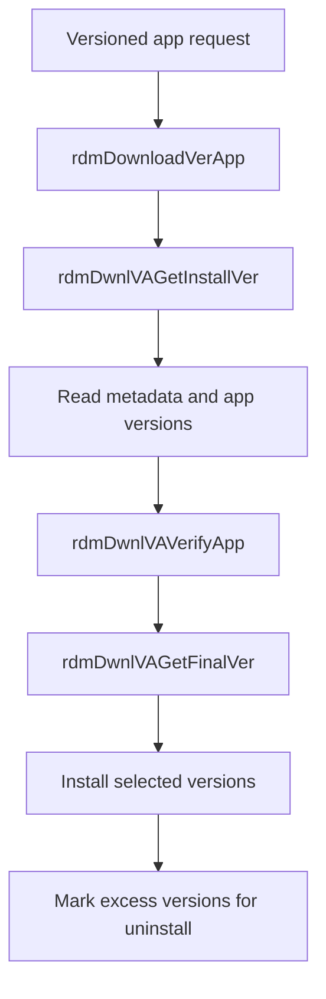

# Versioned App Management

## Scope
This specification covers the verified versioned app lifecycle logic that selects installed versions, validates candidate packages, and removes older versions when the application version set exceeds the configured limit.

## Implementation evidence
- Versioned app flow: [src/rdm_downloadverapp.c](../../../src/rdm_downloadverapp.c)
- Orchestration entrypoint: [src/rdm_download.c](../../../src/rdm_download.c)
- Key functions: `rdmDownloadVerApp`, `rdmDwnlVAGetMetadataPath`, `rdmDwnlVAGetInstallVer`, `rdmDwnlVAGetFinalVer`, `rdmDwnlVAInstall`, `rdmDwnlVAUnInstall`

## External boundaries
- Version metadata and bundle metadata paths are device-defined and may differ by platform or build configuration.
- The repository defines the logic and expected paths, but the actual package bundles and metadata files exist in the runtime environment.
- Version comparison and cleanup behavior are implemented in-repo; the bundles themselves are external inputs.

## Requirements
1. The service must identify bundle metadata locations for cert and app bundles when versioned app metadata is required.
2. The service must collect installed version records and manifest-provided versions before resolving the final set.
3. The service must validate installed versions and remove invalid or older versions when required.
4. The service must install the selected final version set without leaving the version list beyond the configured maximum.

## GIVEN / WHEN / THEN scenarios
### Requirement 1
GIVEN a versioned app record with a bundle type of `cert` or `app`
WHEN `rdmDwnlVAGetMetadataPath` executes
THEN it resolves the bundle metadata file for the given app under the configured metadata directory and returns `RDM_SUCCESS` when the metadata exists.

### Requirement 2
GIVEN a versioned app installed in the app home and bundle metadata present in the manifest or application directory
WHEN `rdmDwnlVAGetInstallVer` runs
THEN it gathers the available version strings, de-dups them, and prepares a candidate list for validation and final installation.

### Requirement 3
GIVEN a versioned app list with more versions than the maximum allowed
WHEN `rdmDwnlVAGetFinalVer` resolves the final set
THEN it keeps the valid version list within the configured maximum and marks excess entries for uninstall.

### Requirement 4
GIVEN a candidate version fails validation in `rdmDwnlVAVerifyApp`
WHEN the verification loop runs
THEN the invalid version is added to the uninstall list and excluded from the final install set.

## Runtime flow

